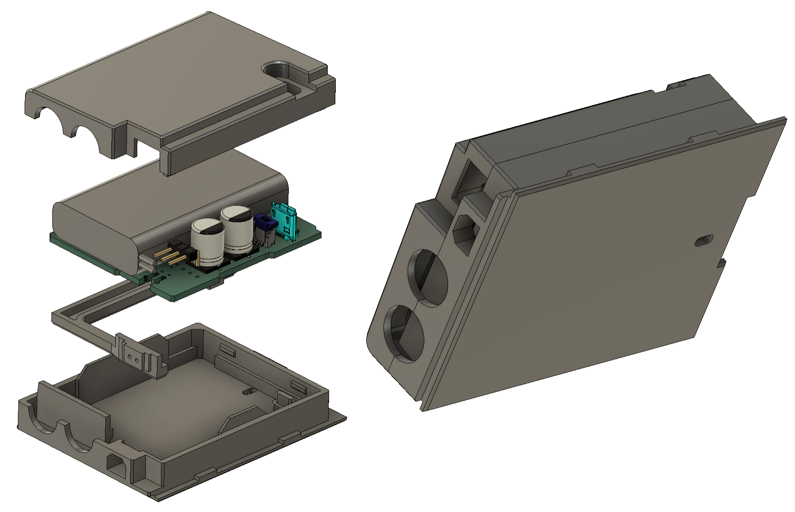

# CalcPack TI BP8

A Li-Po battery replacement design for TI BP7/8/9 battery pack calculators - e.g. TI-55, TI-30, TI Programmer, etc. The original batteries had ~ 500mAh capacity (@2.4V: 1.2Wh), while a typical 9V alkaline battery substitution as ~500mAh (@9V: 4.5Wh), albeit single-use only.

Li-Po has the advantage of far reduced self-discharge in comparison to Ni-Cd, which is an advantage for an intermittently-used device. Even with similar mAh capacity, we can expect longer battery life.

Ni-CD batteries are notorious for leaking. While Lithium Ion batteries are notorious for self-immolation, a well protected Li-Po battery (particularly in a low current application like this) should be able to be made very safe.

## Features / design goals:
- Direct replacement for a BP8 battery pack, compatible with TI55, TI30, TI Programmer (and other Majestic series).
    - Support both 9V battery snap terminal and 3-pin molex connector output
- Compatible with existing charging connection (2-pin AC input; somewhere from 5 to 9VAC)
    - Provides adequate smoothing of rectified AC
    - Provides voltage clamping / overvoltage protection
- Efficient conversion of input rectified supply to 5VDC for charging IC and calculator operation
- Step up from battery or input rectified supply to 9VDC for calculator supply
- Protected from:
    - Overvoltage (input) at 2x rated voltage and current (IATA requirement)
    - Overcharging (4.2V)
    - Over-discharge (3.1V shutdown, 2.5V cutoff in battery pack)
    - Short circuit and overcurrent (again for IATA requirement)
- Minimum idle/quiescent current to maximise charge time
- Similar or higher capacity than typical Ni-MH altenative (1500mAh @ 2.4V: 3.6Wh)

## Case ##

The board is designed to fit into the original TI case bottom part. Due to ridges for the cylindrical NiCd cells, the top part will not fit.

1. The simplest installation is to place the board and 3D printed standoff into the original case bottom, with a dab of hot glue to hold it in place. The back can be left off.
2. If you don't have an original case, a case designed specifically for 3D printing is available (image below).
    * Files with and without support (intended for SLA printing) are provided.
    * The top part is not required. It is designed to be attached with a couple of dots of superglue.

## Availability ##

If you'd like one of these, I may be able to help! Please contact me at info@calcpsu.com.au.
  
## License

This work is licensed under a
[Creative Commons Attribution-NonCommercial-ShareAlike 4.0 International License][cc-by-nc-sa].

[![CC BY-NC-SA 4.0][cc-by-nc-sa-image]][cc-by-nc-sa]

[cc-by-nc-sa]: http://creativecommons.org/licenses/by-nc-sa/4.0/
[cc-by-nc-sa-image]: https://licensebuttons.net/l/by-nc-sa/4.0/88x31.png
[cc-by-nc-sa-shield]: https://img.shields.io/badge/License-CC%20BY--NC--SA%204.0-lightgrey.svg
